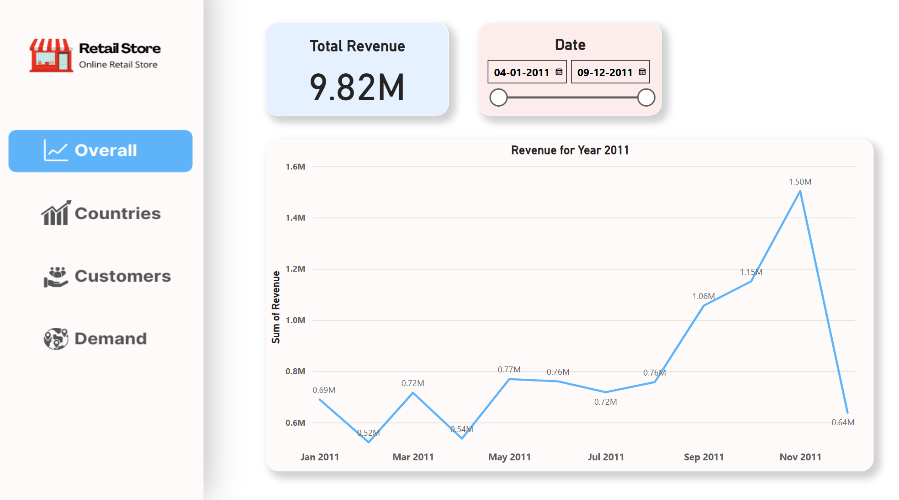
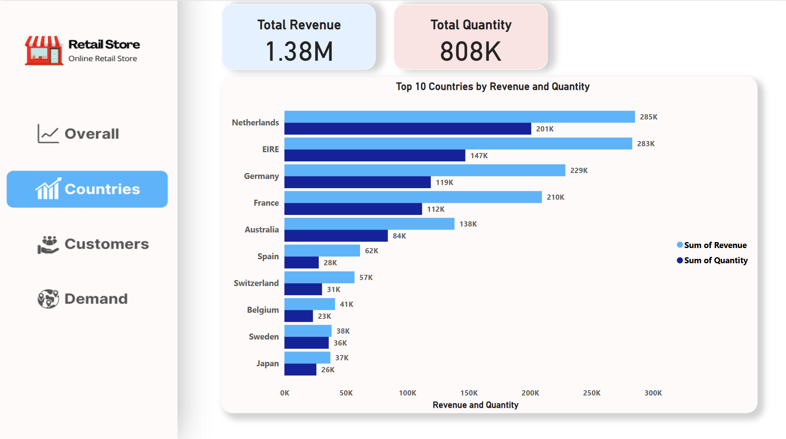
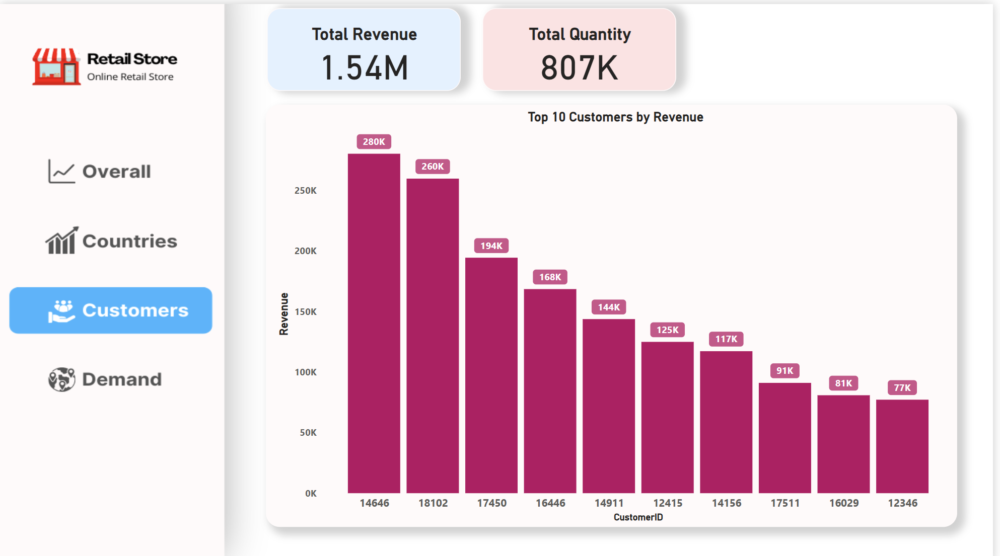
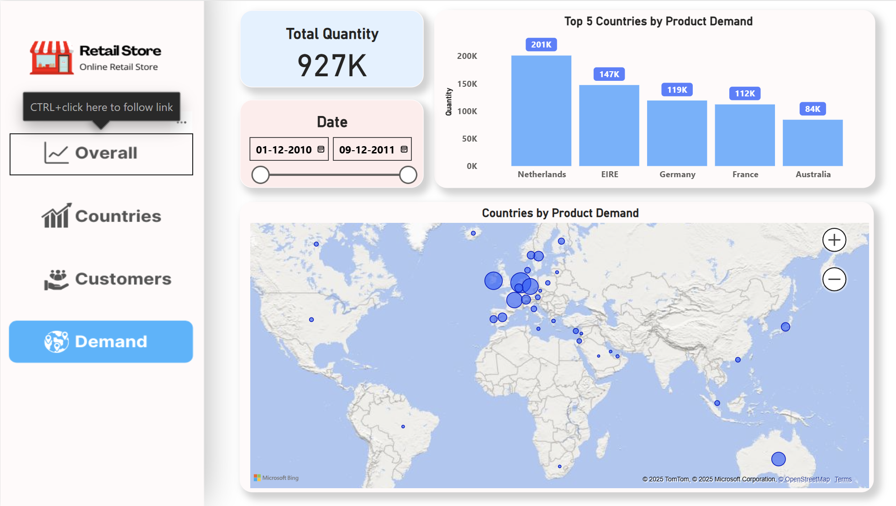

# 🧠 Tata Data Visualisation: Empowering Business with Effective Insights Job
Simulation on Forage - June 2025

## What I have done? - 

 * Completed a simulation involving creating data visualizations for Tata
   Consultancy Services
 * Prepared questions for a meeting with client senior leadership
 * Created visuals for data analysis to help executives with effective decision
   making

## 🎯 Project Objective

The objective of this project is to analyze sales performance data from an online retail store and deliver actionable business insights through interactive Power BI dashboards. The analysis addresses specific business questions posed by the CEO and CMO, focusing on revenue trends, high-performing countries, top customers, and global expansion opportunities.

The dashboards were presented directly to both the **CEO and CMO**, demonstrating not only technical data skills but also the ability to communicate insights clearly and effectively to executive stakeholders.

---

## 🛠️ Tools Used

- Microsoft Power BI  
- Microsoft Excel  
- Data Cleaning & DAX Calculations  
- Data Visualization Principles  

---

## 📦 Project Structure

📁 Dashboard.pbix → Power BI dashboard file (.pbix)
📁 Objective-&-Requirements.pdf → PDF with Objective and business questions
📁 Data-Set.xlsx → Source dataset (.xlsx)
📁 Screenshots/ → Dashboard screenshots (for each question)

---
## 📦 Project Objective & Requirements PDF
 [Objective and Requirements.pdf](/Objective-&-Requirements.pdf)
## 🖼️ Dashboard Previews

---

## 📈 Key Insights

- **Revenue peaked during the holiday season** (Nov–Dec 2011)
- **Top countries** outside the UK are strong contributors to revenue and quantity
- **Top customers** show a large revenue gap, indicating potential retention strategies
- **Expansion opportunities** exist in regions with consistently high demand

---

## 👤 About Me

Hi! I'm **Ishwar**, a B.Tech student and aspiring Product/ Business Analyst 
I’m passionate about solving business problems using data-driven insights and visual storytelling.  
This project is part of my learning journey toward a career in product and business analytics.

🔗 [Connect with me on LinkedIn](#) *(www.linkedin.com/in/ishwar-verrma)*

---

## 📄 Credits

This project was part of the [TATA Data Visualisation Virtual Internship](https://www.theforage.com/) on Forage.
